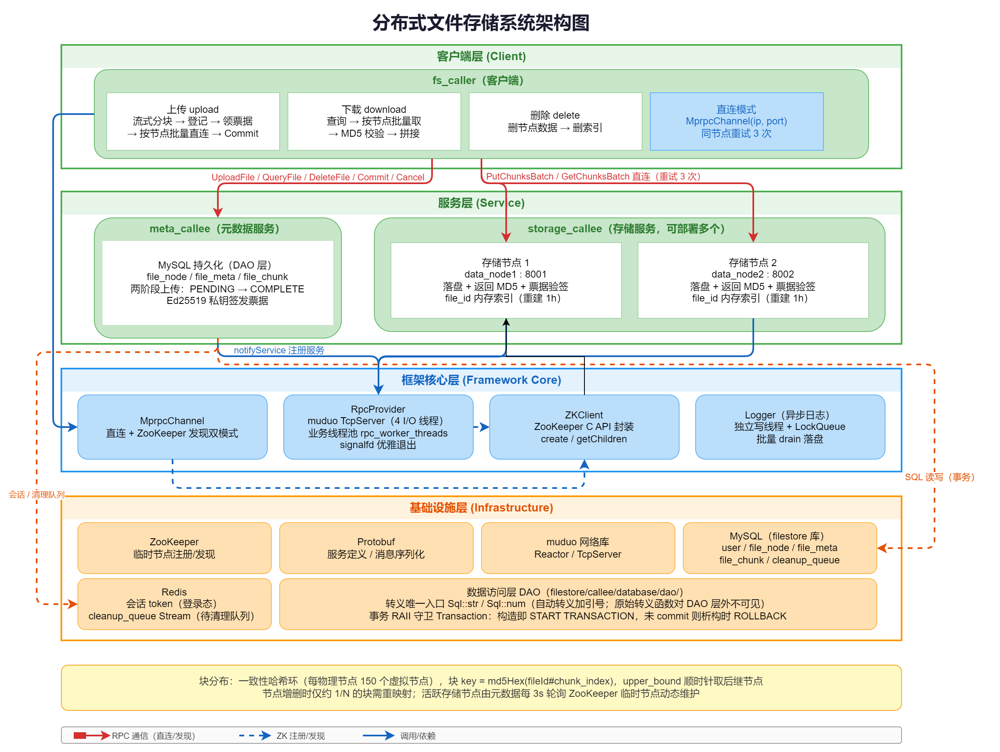
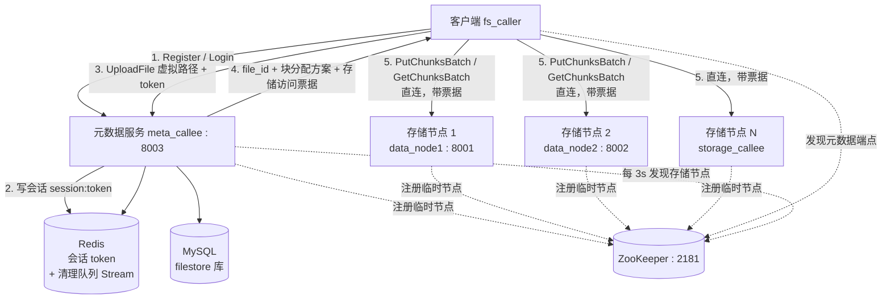
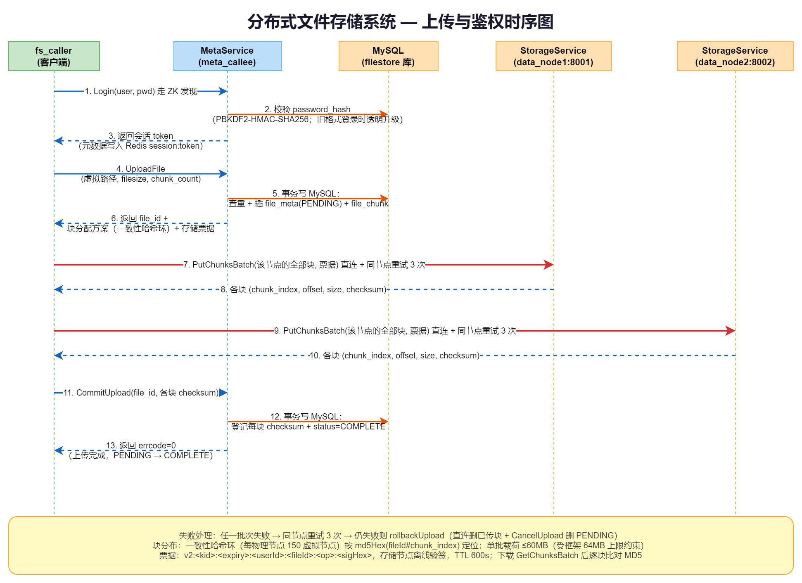
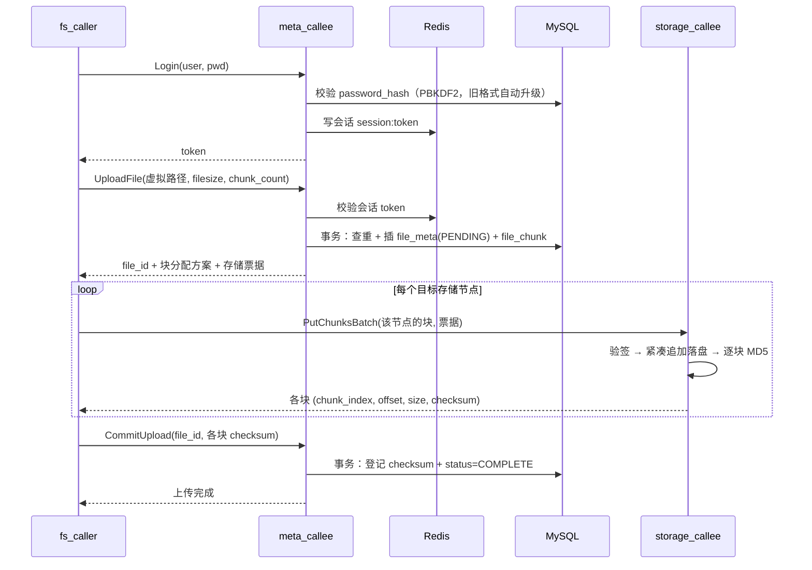
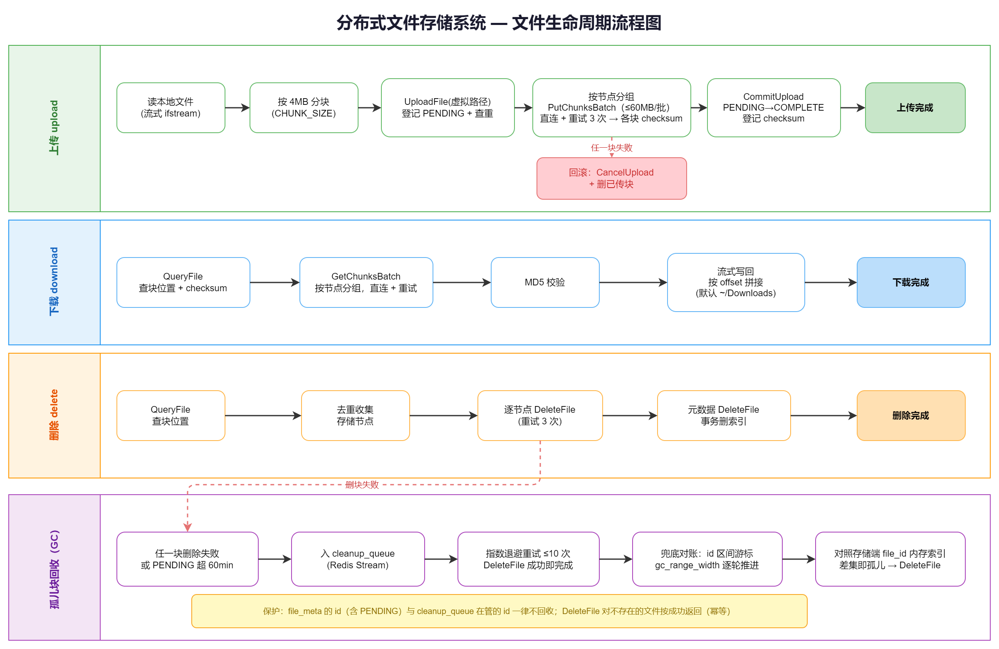
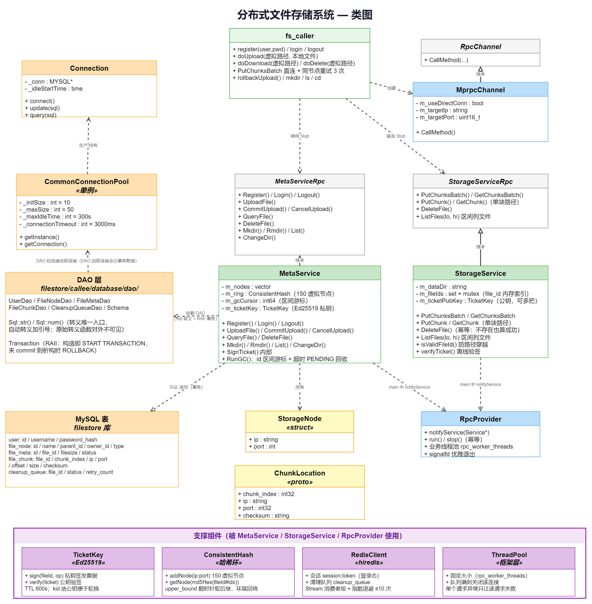

# 分布式文件存储系统（filestore）

一个构建在自研 C++ RPC 框架 **mpRPC** 之上的分布式文件存储系统：客户端把文件按 4MB 分块，
经一致性哈希环分布到多个存储节点直连读写；元数据服务用 MySQL 统一维护虚拟文件树与块索引，
并用 ZooKeeper 临时节点做存储节点的动态上下线感知。

> 底层框架（Protobuf 服务定义 + muduo 网络 + ZooKeeper 注册发现 + 异步日志）见文末
> [底层：mpRPC 框架](#底层mprpc-框架)一节。





## 系统组成

| 组件 | 可执行文件 | 职责 |
|---|---|---|
| 客户端 | `fs_caller` | 命令式 CLI（注册/登录/文件树/上传/下载/删除），拿票据后**直连**存储节点搬块 |
| 元数据服务 | `meta_callee` | 维护虚拟文件树与「文件 → 块位置」索引，签发票据，分配块，跑后台回收 |
| 存储服务 | `storage_callee` | 按 file_id 落盘/读取/删除块，离线验签票据，可水平部署多个实例 |

## 功能特性

- **文件分块存储** — 客户端把文件切成 4MB 的块（单文件上限 `chunk_count ≤ 25600`，即 100GB），按节点分组批量传输
- **网盘式虚拟文件树** — `file_id` 全局唯一 + `file_node` 目录树，支持 `mkdir` / `rmdir` / `ls` / `cd`；深度 ≤64 层、总路径 ≤1024 字符
- **用户鉴权** — 注册/登录用 **PBKDF2-HMAC-SHA256**（100000 次迭代 + 每用户 16 字节随机盐）存口令；登录签发 Redis 会话 token，元数据校验身份与文件归属
- **存储访问票据** — 元数据用 **Ed25519 私钥**签发 `v2:<kid>:<expiry>:<userId>:<fileId>:<op>:<sigHex>` 票据（TTL 600s），存储节点用**公钥**离线验签。非对称的意义：存储节点**能验不能签**，一台节点被攻破不再等于拿到签发能力；公钥可逗号分隔多把，便于轮换
- **元数据持久化** — MySQL 存储，SQL 全部收敛进 DAO 层（转义唯一入口 + RAII 事务）；上传走 PENDING→COMPLETE 状态机，中途失败可补偿回滚
- **块分布多节点** — 一致性哈希环（每物理节点 150 虚拟节点）分配块，节点增删仅约 1/N 的块需重映射
- **服务注册与发现** — 存储节点经 ZooKeeper **临时节点**自动注册；元数据后台每 3s `getChildren` 动态重建哈希环，扩容零重启、宕机自动摘除
- **优雅退出** — `signalfd` 接 SIGINT/SIGTERM，Ctrl+C 后**立即**关闭 ZK 句柄摘除临时节点，不再等 ~30s 会话超时（期间死节点还挂在环上）
- **紧凑存储** — 存储端按 `(offset, size)` 顺序追加写，无固定偏移空洞与内部碎片
- **孤儿块回收** — 删除失败入 Redis Stream 清理队列（指数退避，最多 10 次）；另有 **id 区间游标**兜底对账（对照存储节点内存 file_id 索引取差集）与 **60 分钟超时 PENDING 回收**
- **数据完整性** — 逐块 MD5：存储端写入时计算返回，`CommitUpload` 登记，下载时逐块比对
- **异步日志** — 独立写线程 + 线程安全队列批量落盘，不阻塞 RPC 主流程

## 关键流程

### 上传时序





### 文件生命周期与垃圾回收

```mermaid
flowchart TB
    subgraph UP[上传]
      A1[流式读取本地文件] --> A2[按 4MB 分块]
      A2 --> A3[UploadFile：查重 + 登记 PENDING]
      A3 --> A4[按节点分组 PutChunksBatch<br/>直连 + 单批载荷 ≤60MB + 逐块 MD5]
      A4 --> A5[CommitUpload：PENDING → COMPLETE]
      A4 -.任一块失败.-> A6[回滚：CancelUpload + 删已传块]
    end
    subgraph DOWN[下载]
      B1[QueryFile：查块位置 + checksum] --> B2[按节点分组 GetChunksBatch]
      B2 --> B3[逐块 MD5 比对]
      B3 --> B4[按 offset 流式拼回本地文件]
    end
    subgraph DEL[删除]
      C1[QueryFile：查块位置] --> C2[去重收集涉及的存储节点]
      C2 --> C3[逐节点 DeleteFile，失败重试]
      C3 --> C4[元数据事务删 file_node / file_meta / file_chunk]
    end
    subgraph GC[孤儿块回收]
      D1[删块失败] --> D2[入 cleanup_queue<br/>Redis Stream + 指数退避，最多 10 次]
      D2 --> D3[存储端 DeleteFile 成功后标记完成]
      D4[超时 PENDING 上传 > 60min] --> D5[入队清理 + 事务删元数据]
      D6[兜底：id 区间游标对账<br/>gc_range_width 逐轮推进] --> D7[对照存储端内存 file_id 索引<br/>差集即孤儿 → DeleteFile]
    end
```





### 核心类图



## 快速开始

### 1. 前置依赖

| 依赖 | 用途 |
|---|---|
| Protobuf (with abseil) | 服务定义、消息序列化 |
| muduo (net + base) | 高性能 TCP 网络库（Reactor / TcpServer） |
| ZooKeeper C Client (`zookeeper_mt`) | 服务注册与发现（临时节点） |
| MySQL (`libmysqlclient`) | 元数据持久化（InnoDB 事务） |
| Redis (`hiredis`) | 登录会话 + 待清理队列 Stream |
| OpenSSL | MD5 块校验、PBKDF2 口令、Ed25519 票据签名 |
| pthread、C++17 | 线程库与语言标准 |

运行前需启动 ZooKeeper（默认 `127.0.0.1:2181`）、MySQL（3306）与 Redis（6379）。

### 2. 构建

```bash
./autobuild.sh          # 清理 build/ → cmake → make
# 或：mkdir -p build && cd build && cmake .. && make
```

产物：

- `lib/libmprpc.a` — RPC 框架静态库
- `bin/meta_callee`、`bin/storage_callee`、`bin/fs_caller` — 文件存储三件套
- `bin/ticket_keygen` — Ed25519 票据密钥生成工具
- `bin/callee`、`bin/caller` — RPC 框架示例

### 3. 生成票据密钥（只需一次）

```bash
./bin/ticket_keygen config/keys
# 私钥 config/keys/ticket_priv.pem (0600) —— 只放元数据服务那台机器，绝不提交
# 公钥 config/keys/ticket_pub.pem  (0644) —— 分发给各存储节点
```

`config/keys/` 已在 `.gitignore` 中。**私钥是机密**；密钥缺失或不是 Ed25519 时，
两个服务都会打印明确错误并**拒绝启动**，不会带着空密钥对外服务。

### 4. 配置

| 文件 | 关键项 |
|---|---|
| `config/mysql.cnf` | MySQL 连接参数与连接池参数（**按相对路径读取，必须在项目根目录启动**） |
| `config/filestore_meta.cnf` | 监听地址、ZK 地址、存储节点种子 `storage_nodes`、`[gc]` 回收参数、`[auth] ticket_privkey` |
| `config/filestore_storage{1,2,3}.cnf` | 监听地址、`[storage] data_dir` 与 `index_rebuild_sec`、`[auth] ticket_pubkey` |

票据配置里写的是**路径**而不是密钥本身，因此密钥不上环境变量、不上命令行
（路径可用 `MPRPC_TICKET_PRIVKEY` / `MPRPC_TICKET_PUBKEY` 覆盖）。

### 5. 启动服务

必须在**项目根目录**执行（连接池按相对路径读 `config/mysql.cnf`）：

```bash
# 元数据服务（8003）—— 需要私钥
./bin/meta_callee -i config/filestore_meta.cnf

# 存储节点（8001 / 8002 / 8004）—— 只需要公钥
./bin/storage_callee -i config/filestore_storage1.cnf
./bin/storage_callee -i config/filestore_storage2.cnf
./bin/storage_callee -i config/filestore_storage3.cnf
```

验证注册是否生效：

```bash
$ZOOKEEPER_HOME/bin/zkCli.sh -server 127.0.0.1:2181 ls /StorageServiceRpc/PutChunk
# 应列出各存储节点的 ip:port
```

`-i` 指定配置文件路径，为必选项。Ctrl+C 退出时会立即摘除自己注册的临时节点。

### 6. 客户端使用

```bash
CFG="-i config/filestore_meta.cnf"      # 客户端连元数据服务

./bin/fs_caller $CFG register alice 123456
./bin/fs_caller $CFG login alice 123456

./bin/fs_caller $CFG mkdir /docs
./bin/fs_caller $CFG ls /
./bin/fs_caller $CFG upload ./report.txt /docs/report.txt
./bin/fs_caller $CFG download /docs/report.txt -o /tmp/report.txt
./bin/fs_caller $CFG delete /docs/report.txt
./bin/fs_caller $CFG rmdir -r /docs
```

| 命令 | 说明 |
|---|---|
| `register <user> <pwd>` / `login <user> <pwd>` / `logout` | 账号与会话 |
| `ls [path]` / `mkdir <path>` / `rmdir [-r] <path>` / `cd <path>` | 虚拟文件树 |
| `upload <本地文件> <虚拟路径>` | 上传（两个参数都要给） |
| `download <虚拟路径> [-o 目标]` | 下载；**不加 `-o` 会落到 `~/Downloads/` 下** |
| `delete <虚拟路径>` | 删除 |

token 存 `~/.fscli/token`、当前目录存 `~/.fscli/cwd`——都是本地状态，异常时先 `logout` 清掉。

## 通信与安全

### RPC 帧格式


```
┌──────────────┬──────────────────────────┬─────────────────┐
│ header_size  │  RpcHeader (protobuf)    │  args (protobuf) │
│   (4 bytes)  │  service_name            │  request body    │
│              │  method_name             │                  │
│              │  args_size               │                  │
└──────────────┴──────────────────────────┴─────────────────┘
```

响应帧为 `[resp_size(4B)][responseStr]`；服务端按长度循环分帧，客户端先读长度再读满，
以正确处理批量 RPC 的大请求/大响应。

### 存储访问票据

元数据签发的票据形如 `v2:<kid>:<expiry>:<userId>:<fileId>:<op>:<sigHex>`：

- `kid` = `SHA256(SPKI DER)` 的前 32 个十六进制字符（用于轮换时按密钥标识选公钥）；
- 签名覆盖**末段之前的整个字面串**（含版本与 kid），防篡改；
- 绑定 `userId` / `fileId` / `op`（`put` / `get` / `del` / `list`）与过期时间（TTL 600s），
  存储节点离线验签，跨用户越权读写会被拒。

### ZooKeeper 注册结构

```
/StorageServiceRpc/<Method>/<ip:port>     ← 临时节点（进程退出或 Ctrl+C 后立即删除）
```

元数据服务注册自己的 `<Method>` 路径供客户端发现；存储节点同理，元数据每 3s
`getChildren` 一次据以重建一致性哈希环（空结果保留旧环，防 ZK 抖动误清空节点集合）。

## 目录结构

```
include/            — 框架公共头文件（mprpc_*、zk_client_util、logger、thread_pool）
src/                — 框架核心实现（编译为 libmprpc.a）
proto/              — 框架内部通信协议 (rpcheader.proto)
example/            — RPC 框架示例（UserService / FriendService）
filestore/          — 分布式文件存储系统
  proto/            — MetaServiceRpc + StorageServiceRpc 定义
  common/           — CHUNK_SIZE、一致性哈希、口令散列、票据
  callee/meta/      — 元数据服务（文件树 + 鉴权 + 块分配 + 后台回收）
  callee/storage/   — 存储服务（块落盘/读取/删除 + file_id 内存索引）
  callee/database/  — MySQL 连接池 + dao/ 数据访问层
  callee/redis/     — Redis 封装（会话 + 清理队列 Stream）
  caller/           — 客户端（终端 CLI 的 RPC 逻辑）
  tools/            — ticket_keygen（Ed25519 密钥对）
config/             — 配置模板（mprpc.cnf、filestore_*.cnf；keys/ 已 gitignore）
diagrams/           — 架构图、时序图、流程图、协议图（PNG）
test/               — 离线单元测试、集成测试脚本与实测报告（test/README.md、test/test-report.md）
thirdparty/         — 单头文件第三方库
```

## 底层：mpRPC 框架

filestore 是 mpRPC 的第一个真实使用场景；框架本身也可独立用于其他 RPC 服务。
服务注册发现的调用链路是：`RpcProvider::notifyService()` 注册服务对象 → `run()` 启动
muduo TcpServer 并把每个方法注册为 ZK 临时节点 → 客户端 `MprpcChannel::CallMethod()`
经 ZK 发现端点、序列化请求、TCP 收发、反序列化响应。

### 核心类

| 类 | 角色 |
|---|------|
| `MprpcApplication` | 单例，框架入口。解析 CLI 参数 `-i <configfile>`、加载配置、阻塞 SIGINT/SIGTERM（供 signalfd 接） |
| `MprpcConfig` | INI 配置解析器，带类型的取值接口（`getInt` / `getPositiveInt` / `getInt64` / `getString`，**不抛异常**） |
| `RpcProvider` | 服务提供方。muduo TcpServer（4 个 I/O 线程）接收请求，**handler 提交给框架层业务线程池**（`rpc_worker_threads`，默认 4，设 0 则退回在 I/O 线程同步执行），并把服务注册到 ZooKeeper；`signalfd` 优雅退出 |
| `MprpcChannel` | 继承 `google::protobuf::RpcChannel`，负责请求序列化、ZK 服务发现、TCP 收发、响应反序列化；支持直连 `ip:port` |
| `MprpcController` | 继承 `google::protobuf::RpcController`，追踪调用状态（失败/错误信息） |
| `ZKClient` | ZooKeeper C 客户端封装（`create` / `getData` / `getChildren`）。临时节点冲突视为**注册失败并退出**，避免「进程活着却没人发现」 |
| `Logger` | 异步日志模块，独立写线程 + `LockQueue` 缓冲，按日期写入 `logs/<Y-M-D>_<进程名>.log` |
| `LockQueue<T>` / `ThreadPool` | 线程安全队列（支持批量 drain）与固定大小业务线程池 |

> 架构与时序图沿用仓库根 `diagrams/` 下的四张 PNG。其中**未含**上述两处较新的框架改动
> ——业务线程池与 `signalfd` 优雅退出，读图时请以上表为准。

示例运行：

```bash
./bin/callee -i config/mprpc.cnf     # 服务端
./bin/caller -i config/mprpc.cnf     # 客户端
```

### 扩展：添加一个新的 RPC 服务

1. 写 `.proto`，必须开 `option cc_generic_services = true;`，然后用 `protoc` 生成 C++ 代码：

```protobuf
syntax = "proto3";
package example;
option cc_generic_services = true;

message HelloRequest  { string name = 1; }
message HelloResponse { string message = 1; }

service HelloService { rpc SayHello(HelloRequest) returns(HelloResponse); }
```

2. **服务端**：继承生成的 Service 类、重写虚函数，注册后 `run()` 阻塞：

```cpp
class HelloServiceImpl : public example::HelloService {
public:
    void SayHello(google::protobuf::RpcController*,
                  const example::HelloRequest* request,
                  example::HelloResponse* response,
                  google::protobuf::Closure* done) override {
        response->set_message("Hello, " + request->name());
        done->Run();          // 触发响应序列化与回发
    }
};

int main(int argc, char** argv) {
    MprpcApplication::init(argc, argv);
    RpcProvider provider;
    provider.notifyService(new HelloServiceImpl());
    provider.run();
    return 0;
}
```

3. **客户端**：构造 `MprpcChannel` 传给生成的 `_Stub`：

```cpp
int main(int argc, char** argv) {
    MprpcApplication::init(argc, argv);

    example::HelloRequest  request;   request.set_name("World");
    example::HelloResponse response;
    MprpcChannel channel;
    example::HelloService_Stub stub(&channel);
    stub.SayHello(nullptr, &request, &response, nullptr);

    std::cout << response.message() << std::endl;   // "Hello, World"
    return 0;
}
```
